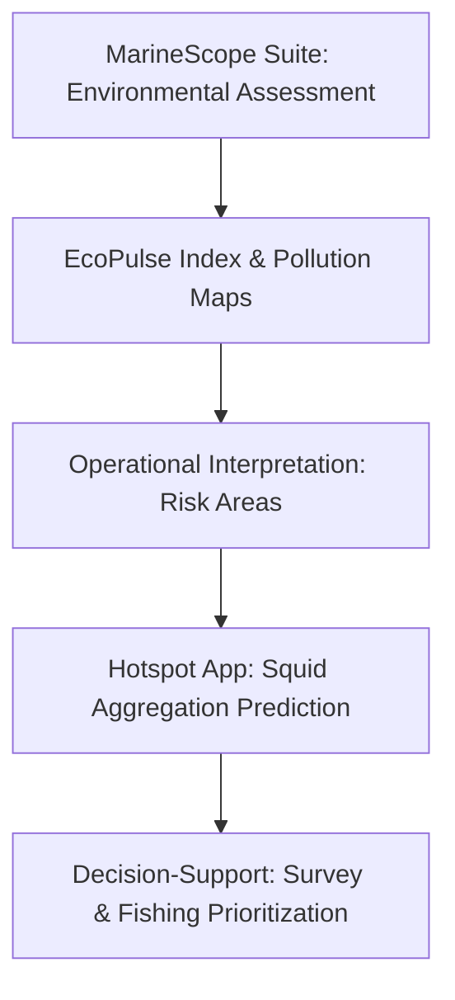

# 🌊 MarineScope Suite — Environmental Decision-Support Platform

## Decision Context & Problem Framing

Marine ecosystems face multiple human pressures, including chemical pollution, habitat disruption, and overfishing. Environmental managers, NGOs, and consultancies require **actionable insights** that translate observational data into spatially and temporally understandable intelligence.  

The **MarineScope suite** was designed to address this need, integrating environmental data interpolation, predictive modeling, ecosystem health indices, and scenario-based analyses. Stakeholders can use it to:

- Prioritize monitoring and intervention sites.
- Interpret ecological risk in marine habitats.
- Support scenario-informed policy, restoration, or regulatory decisions.

---

## Scenario / Use Case

Consider a **squid fishery in the North Atlantic** during 2018–2021. Managers need to:

- Assess potential contamination in catch areas due to industrial and agricultural runoff.
- Identify regions where ecosystem stress may threaten juvenile populations.
- Compare pre- vs post-COVID human activity effects on ecosystem resilience.

MarineScope provides **spatial and temporal insights** to support these decisions, integrating chemical, environmental, and ecological data.

---

## Key Insights & Findings

- **High-risk areas** correlate with industrial and agricultural activity, as predicted by environmental signals.  
- **EcoPulse Index** identifies regions where juvenile sensitivity is high, guiding early-stage monitoring.  
- **Disruption Dynamics** shows ecosystem responses to COVID-related reductions in human activity, helping identify resilient vs vulnerable zones.  
- Visual patterns support **targeted sampling**, intervention planning, and scenario evaluation without over-interpreting screening-level predictions.

---

## Methodology & Technical Approach

MarineScope combines **geostatistics, predictive modeling, and interactive visualization**:

1. **Seafloor Signals**: Interpolates pollutant concentrations across the seabed using spatial averaging techniques.  
2. **Toxic Tide**: Predicts pollution intensity by linking human activity and environmental variables using regression modeling.  
3. **EcoPulse Index**: Combines biological, chemical, and environmental layers into a stress-to-resilience score, with dynamic filters for tissue, maturity, and year.  
4. **Disruption Dynamics**: Compares pre- vs post-COVID ecosystem scores to quantify sensitivity to changes in human activity.

**Tools & Techniques:** Python (pandas, geopandas, rasterio, scikit-learn), Streamlit for dashboards, Plotly/Folium for interactive mapping, and custom utilities for preprocessing and index calculation.

---

### 🌐 Extended Decision Context & Operational Integration

While the MarineScope suite provides **data-driven ecosystem and environmental assessments**, operational decision-making in fisheries often requires knowledge of **where squid are likely to aggregate**. The **Hotspot App** complements MarineScope by translating **historical catch and environmental predictors** into actionable **squid aggregation hotspots**, both retrospective and predictive.  

**Use Case Example:**  
- Fisheries managers can prioritize **survey and fishing effort** in polygons with historically high catch rates or predicted aggregation probability.  
- Operational planning can be **risk-informed**, focusing on areas with the greatest likelihood of squid presence while avoiding low-yield regions.  
- Hotspot outputs contextualize MarineScope insights by **linking environmental conditions to likely squid aggregations**, enabling informed, adaptive decision-making.

**Decision-Support Value:**  
- Supports scenario-informed allocation of survey and fishing effort.  
- Provides **visual, actionable outputs** for stakeholder reporting and operational planning.  
- Enables integration of historical and predictive data, **bridging ecological assessment and fishery operations** without over-interpreting model outputs.

---

### 🗺️ Decision Pipeline Diagram

---

## Limitations & Considerations

- Accuracy depends on **sampling density and spatial coverage**.  
- Predictions are **screening-level**, not regulatory-grade measurements.  
- Assumptions may vary depending on environmental driver.  
- Small sample sizes can produce **less robust spatial patterns**.  
- Future improvements: integrate **ocean currents, seasonal effects, additional environmental drivers, and automated hotspot detection**.

---

## Lessons Learned / Consultancy Insights

- **Spatial interpolation and predictive modeling** can turn sparse observations into actionable intelligence.  
- **Ecosystem indices** like EcoPulse provide a holistic framework for decision-making beyond raw measurements.  
- Integration of predictive and operational modules (e.g., Hotspot App) enables **scenario-informed, adaptive management**.  
- Visual, interactive outputs enhance **stakeholder communication and rapid decision-making**.  
- Even screening-level predictions, when combined across modules, **guide monitoring, intervention, and resource allocation effectively**.

---

## Executive Takeaway

MarineScope, augmented by the Hotspot App, offers **consultancy-grade, decision-support capabilities**. By combining **interpolation, prediction, ecosystem health indices, and scenario analysis**, the suite enables environmental managers and consultancies to:

- Identify **ecological risks**  
- Prioritize **sampling and interventions**  
- Make **informed, evidence-based decisions** in complex marine contexts
